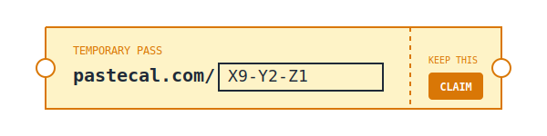

# Creative UX Concepts for URL Claiming

Here are three distinct high-fidelity UX concepts for making the "URL Claiming" process clearer, friendlier, and more obvious that customization is encouraged.

## Concept 1: The "URL Builder" (Unified Pill)

This concept treats the URL and the "Claim" action as a single, cohesive unit. It borrows from modern "Domain Search" or "Browser Address Bar" patterns.

**Why it works:**
- **Unity:** The "Claim" button is physically attached to the name, reinforcing that you are claiming *this specific name*.
- **Clear Hierarchy:** `pastecal.com/` is static (the platform), the input is dynamic (your space).
- **Discovery:** The "Magic Wand" (or Shuffle) is integrated, suggesting generation is a tool, not a requirement.

## Concept 2: The "Unlocked Resource" Metaphor

This concept uses the metaphor of a "Lock" to indicate state. An unsaved calendar is "Unlocked" (Temporary, open). Claiming it "Locks it down" (Makes it yours/permanent).

**Why it works:**
- **State Awareness:** The open lock clearly communicates "This is not safe/saved yet".
- **Metaphor:** "Locking in" a name is a common phrase.
- **Urgency:** An open lock creates a subtle psychological desire to close/secure it.

## Concept 3: The "Golden Ticket" (Gamified)

This concept treats the URL as a "Ticket" that has been issued to you. It visually looks like a physical object you are holding.

**Why it works:**
- **Tangibility:** Makes the digital resource feel valuable.
- **Playful:** Matches the "no login, instant" vibe of PasteCal.
- **Clarity:** "Admit One" implies ownership.

## Recommendation

**Concept 1 ("URL Builder")** is the most professional and extensible. It naturally educates the user about the URL structure (`domain` + `slug`) and creates a tight coupling between typing the name and claiming it.

It fits well with the current layout but elevates the polish significantly.
