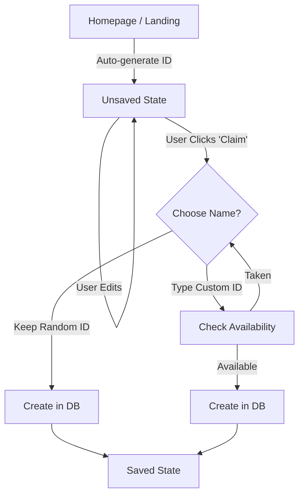

# UX Improvement Specification: Creation & Renaming Flow

## 1. Problem Statement

### Current Friction Points
1.  **Creation Confusion:** Users land on a homepage with a random ID (`pastecal.com/A1B2C3D4`). They can start editing immediately (saved to LocalStorage). However, they often forget to click "Save" to persist it to the server ("Claiming" the URL). If they clear cache or change devices, the data is lost because the URL was never actually created in the backend.
2.  **"Save" Ambiguity:** The "Save" button doesn't clearly convey "Claim this URL permanently". Users might think it's for saving *changes* to events (which is auto-saved).
3.  **Renaming Difficulty:** Users want to rename their calendars (e.g., from `A1B2C3D4` to `project-alpha`). Currently, this is not supported, leading to stuck URLs.

## 2. Proposed Solution: "Claim & Rename"

### A. Improved Creation Flow

Instead of a subtle "Save" button, we introduce a distinct **"Unclaimed" state**.

#### Visual Indicators
-   **Unclaimed Calendar:**
    -   Top bar shows a warning/badge: "Unsaved Calendar" or "Temporary URL".
    -   The "Save" button is replaced/augmented with a primary call-to-action: **"Claim URL"** or **"Save Forever"**.
    -   **URL Customization:** The input field shows the auto-generated ID but includes a **"Shuffle" (Dice)** icon. This visual cue explicitly teaches users: "This ID is temporary/random, you can roll a new one, or click and type your own."

#### The "Claim" Action
1.  User clicks "Claim URL".
2.  **Intervention Check:**
    -   If the user *has not* customized the ID (it's still auto-generated/random), show a **"Review Name" Modal**.
    -   **Modal Content:**
        -   "You're claiming `pastecal.com/XYZ123`."
        -   "Tip: Give it a custom name like `trip-2025` to make it easier to remember."
        -   Input field: Pre-filled with `XYZ123` (focused).
        -   Buttons: "Claim URL" (Primary), "Cancel".
    -   If the user *has* customized the ID (typed in it), skip the modal and proceed to create.

3.  **Action:**
    -   Check if ID exists.
    -   If free -> Create in Firebase -> Redirect to new URL (if changed) -> Show success ("Calendar Saved!").

### B. Rename as "Copy & Move"

Since renaming a distributed resource (URL) breaks existing links, "Renaming" will be implemented as a **Copy to New URL** operation.

#### The Flow
1.  User goes to **Settings** -> **Rename Calendar**.
2.  **Input:** Enter new desired ID (e.g., `new-name`).
3.  **Validation:** Check if `new-name` is available.
4.  **Execution:**
    -   Read data from `old-id`.
    -   Write data to `new-id`.
    -   **Redirect** user to `pastecal.com/new-name`.
5.  **Old Calendar Handling (Options):**
    -   *Option A (Soft Move):* Leave old calendar as is (effectively a "Save As").
    -   *Option B (Hard Move):* Replace old calendar content with a "Moved" placeholder linking to the new one. (Safer for preventing confusion).

## 3. User Flows & Diagrams

### Flow 1: Creation / Claiming



### Visualizing the States (SVG)

#### Figure 1: Unsaved State vs Saved State

```svg
<svg xmlns="http://www.w3.org/2000/svg" viewBox="0 0 800 200">
  <!-- Background -->
  <rect x="0" y="0" width="800" height="200" fill="#f9fafb" />
  
  <!-- State 1: Unsaved -->
  <g transform="translate(50, 50)">
    <rect x="0" y="0" width="300" height="50" rx="8" fill="#fff" stroke="#ccc" />
    <text x="15" y="30" font-family="sans-serif" font-size="14" fill="#999">pastecal.com/</text>
    <text x="100" y="30" font-family="sans-serif" font-size="14" fill="#333">X9Y2Z1</text>
    
    <!-- Badge -->
    <rect x="220" y="10" width="70" height="30" rx="15" fill="#FFF3CD" stroke="#FFC107" />
    <text x="255" y="30" font-family="sans-serif" font-size="12" fill="#856404" text-anchor="middle">Unsaved</text>
  </g>
  
  <!-- Arrow -->
  <path d="M 370 75 L 430 75" stroke="#333" stroke-width="2" marker-end="url(#arrowhead)" />
  
  <!-- State 2: Claiming Action -->
  <g transform="translate(450, 50)">
     <rect x="0" y="0" width="300" height="100" rx="8" fill="#fff" stroke="#ccc" />
     <text x="20" y="30" font-family="sans-serif" font-weight="bold" font-size="14">Claim this Calendar</text>
     <text x="20" y="55" font-family="sans-serif" font-size="12" fill="#666">Choose a permanent link:</text>
     
     <!-- Input -->
     <rect x="20" y="65" width="180" height="25" rx="4" fill="#eee" />
     <text x="25" y="82" font-family="sans-serif" font-size="12" fill="#333">my-awesome-cal</text>
     
     <!-- Button -->
     <rect x="210" y="65" width="70" height="25" rx="4" fill="#007bff" />
     <text x="245" y="82" font-family="sans-serif" font-size="12" fill="white" text-anchor="middle">Claim</text>
  </g>
  
  <defs>
    <marker id="arrowhead" markerWidth="10" markerHeight="7" refX="0" refY="3.5" orient="auto">
      <polygon points="0 0, 10 3.5, 0 7" />
    </marker>
  </defs>
</svg>
```

## 4. Implementation Details

### Changes to `public/index.html` (Vue App)

1.  **State Management:**
    -   Refine `isExisting` logic.
    -   Add `isUnsaved` computed property: `!isExisting && !isReadOnly`.
    
2.  **UI Updates (Top Bar):**
    -   **Condition:** `v-if="isUnsaved"`
    -   **Display:**
        -   Show "Unsaved" badge (Yellow).
        -   Show "Claim / Save" button (Primary Blue).
        -   Input field for ID should be editable but maybe highlighted.
    
3.  **Rename Functionality (Settings Panel):**
    -   Add "Danger Zone" or "Actions" section in Settings.
    -   "Rename / Move Calendar":
        -   **Restriction:** Only available for likely "autogenerated" IDs (e.g., 8-char random strings). Custom/Named calendars cannot be "renamed" (moved) to prevent hijacking or confusion.
        -   Input: New ID.
        -   Button: "Move".
        -   Logic: 
            ```javascript
            async rename(newId) {
                if (!isAutogenerated(currentId)) return error("Only auto-generated calendars can be renamed.");
                if (exists(newId)) return error;
                await createWithId(newId, currentData);
                // Optional: await delete(oldId); 
                window.location = "/" + newId;
            }
            ```

### 5. Security & Validation rules
-   **ID Rules:** alphanumeric, hyphens, underscores. Max length 40.
-   **Availability:** Must check Firebase `once('value')` before writing.
-   **Permissions:** Currently public, so "moving" is really just copying. Any user can "copy" a public calendar to a new name. This is acceptable for now.
-   **Rename Restriction:** To prevent hijacking of known/shared names (e.g., someone moving `team-events` to `hacked-events`), the "Rename/Move" UI is only exposed for IDs that appear to be system-generated (random 8-char strings).

## 6. Security Considerations for Move/Rename

### Abuse Vectors
The "Rename" feature, specifically if implemented as a "Move" (Copy + Delete original), introduces potential abuse vectors.
-   **Unauthorized Move:** Since calendars are public-write (anyone with the URL can edit), a malicious actor could "move" a calendar they don't own to a new URL, effectively deleting the original from its known location.
-   **Hijacking:** An attacker could move a popular calendar `community-events` to `hacked-events` and then immediately claim `community-events` for themselves with malicious content.

### Mitigation Strategy
-   **Defer Deletion:** For the MVP, "Renaming" should strictly be **"Save Copy As..."**. We will **NOT** delete the original calendar.
-   **Benefit:** This removes the destructive element. If someone "moves" a calendar, they are just creating a fork. The original remains accessible at the original URL.
-   **Future:** To implement a true "Move/Rename" (with redirection or deletion), we would need an ownership model (passwords, accounts, or creator tokens) which is currently out of scope.