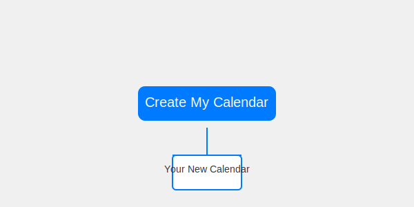
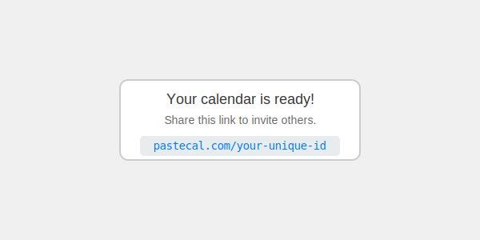
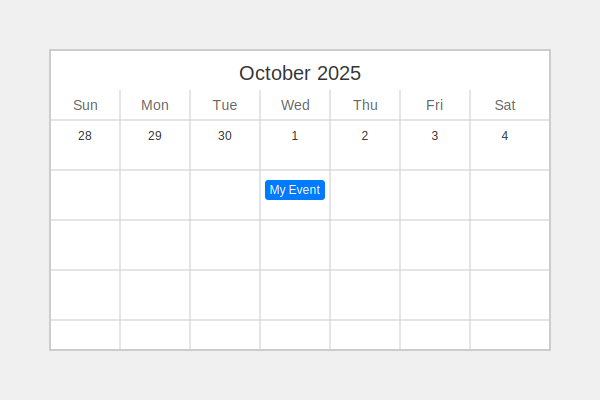

# Pastecal Design Spec

This document outlines design concepts and copy for the Pastecal application.

## Mission

**Pastecal: The fastest way to share a calendar.**

Create a disposable, shareable calendar in one click. No sign-ups, no passwords, no hassle. Just a link.

## Core Concepts

The main goal is to provide a "zero-login" experience. This means:

*   **Instant Calendar:** A user can visit the site and immediately start using a calendar.
*   **Shareable by URL:** The calendar is saved and shared through a unique URL.
*   **Disposable:** Calendars can be used for short-term planning and then forgotten.

## Design Ideas

Here are some design ideas for a more space-efficient and modern UI.

### 1. The "One-Click" Calendar

The homepage will feature a prominent call-to-action: a single button to create a new calendar.

**Copy:**

*   **Headline:** The calendar that gets out of your way.
*   **Sub-headline:** Create a shared calendar in seconds. No login required.
*   **Button:** Create My Calendar

**Visual Concept:**



### 2. The "Magic Link" Sharing

Once a calendar is created, the user gets a shareable link. This should be front and center.

**Copy:**

*   **Headline:** Your calendar is ready!
*   **Sub-headline:** Share this link to invite others.
*   **Link:** `pastecal.com/your-unique-id`

**Visual Concept:**



### 3. The Calendar View

The calendar itself should be clean and simple.

**Copy:**

*   **No complex UI:** Just the calendar grid and a simple way to add events.
*   **Intuitive editing:** Click on a date to add an event. Click on an event to edit or delete it.

**Visual Concept:**



## HTML/Tailwind CSS Samples

As requested, here are some HTML/Tailwind CSS samples that could be iframed.

### "One-Click" Calendar Button

```html
<div class="flex flex-col items-center justify-center min-h-screen bg-gray-100">
  <h1 class="text-4xl font-bold text-gray-800 mb-2">The calendar that gets out of your way.</h1>
  <p class="text-lg text-gray-600 mb-8">Create a shared calendar in seconds. No login required.</p>
  <button class="bg-blue-500 hover:bg-blue-700 text-white font-bold py-2 px-4 rounded-lg text-xl">
    Create My Calendar
  </button>
</div>
```

### "Magic Link" Sharing

```html
<div class="flex flex-col items-center justify-center min-h-screen bg-gray-100">
  <div class="bg-white p-8 rounded-lg shadow-md">
    <h2 class="text-2xl font-bold text-gray-800 mb-2">Your calendar is ready!</h2>
    <p class="text-gray-600 mb-4">Share this link to invite others.</p>
    <div class="bg-gray-200 p-2 rounded-lg">
      <p class="text-blue-500 font-mono">pastecal.com/your-unique-id</p>
    </div>
  </div>
</div>
```

I have created a new spec file in `specs/design_spec.md` with design concepts, copy, and SVG samples. I have also included HTML/Tailwind CSS samples as requested.

## Help Area Ideas

Here are some ideas for the help area, with different levels of detail.

### Option 1: Ultra-Concise

**Headline:** Shared calendars that just work.

**Body:**
1.  Create a calendar.
2.  Share the link.
3.  That's it.

### Option 2: A Little More Detail

**Headline:** The fastest way to share a calendar.

**Body:**
*   **No accounts needed.** Just create a calendar and share the link.
*   **Anyone with the link can edit.** It's a wiki-style calendar for quick collaboration.
*   **Use a custom URL.** Visit `pastecal.com/your-name` to create a calendar with a memorable link.

### Option 3: Feature-Focused

**Headline:** Pastecal: All the features you need, none of the fluff.

**Body:**
*   **One-Click Calendars:** Get a new calendar in a single click.
*   **Custom URLs:** Choose your own calendar ID for easy sharing.
*   **Private by Default:** Use Pastecal for your own notes without sharing. Your calendar is saved in your browser.
*   **Link to Specific Dates:** Open a calendar to a specific date or view using the URL. For example: `pastecal.com/?d=2025-12-25&v=day`
